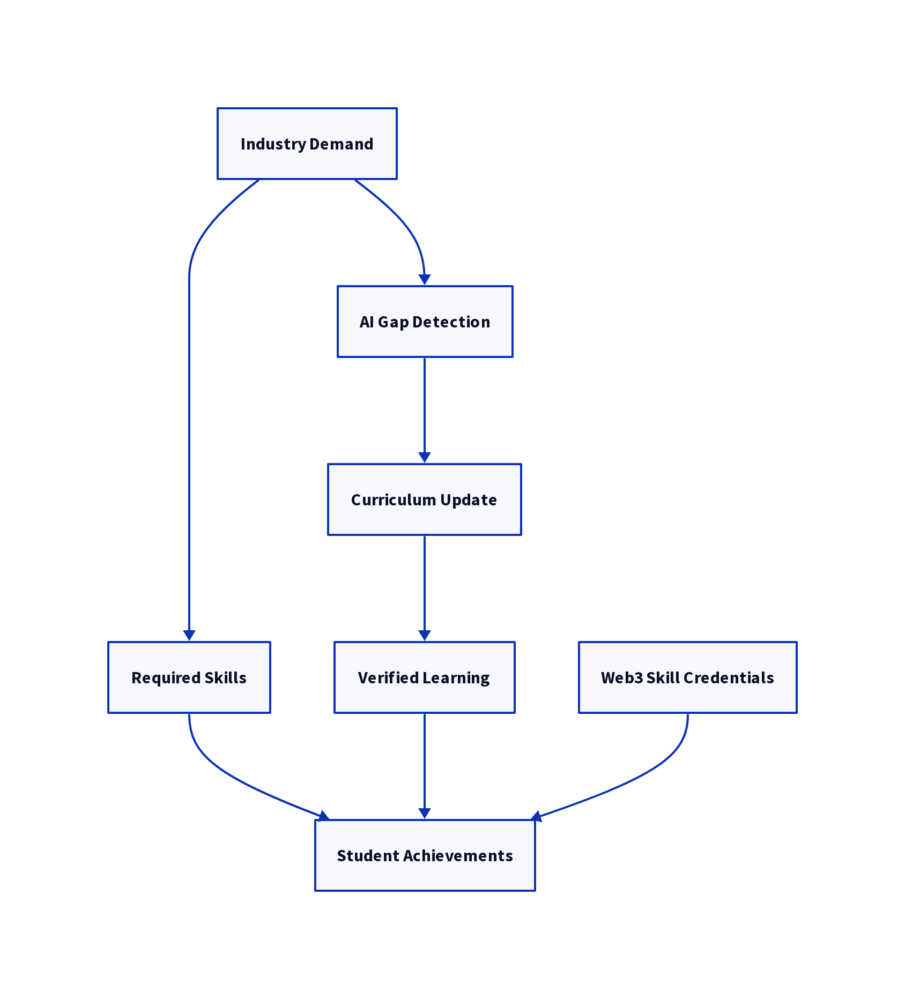

# SkillChain EDU

**AI-Powered Curriculum Intelligence + Web3 Student Skill Identity**

> [!important]
> **Core insight:** Curriculums don’t match industry needs and student abilities aren’t properly represented. SkillChain EDU solves both — together.

---

---

## 🚨 Attention BS Computer Science of NUD!

We **ONLY have 2 DAYS left** to finalize SkillChain EDU for SECA!  
This is **your chance to contribute**, learn, and be part of a project that **could impress judges and showcase ComSci innovation**.  

Every contribution counts —**big or small**— and **everyone will be acknowledged**. Let’s pull together and make this happen! 💪🔥

## ⚡ How to Contribute RIGHT NOW

1. Pick a task from [GitHub Milestones](https://github.com/aishenreemo/skillchain_edu/milestone/1)
2. Comment you’re taking it  
3. Work on it immediately  
4. Just comment your work, Google Docs with no write access or anything you want to add. If you want a pull request, go on, I'll guide you if needed
5. Get **acknowledged** in the README and presentation  

> ⏰ We must finish **all tasks in 2 days** (December 1, 2025) — no delays!

---

## Project Overview

SkillChain EDU is an AI-driven curriculum intelligence platform integrated with a Web3 student skill identity layer. It continuously analyzes course syllabi, job market demands, and emerging technologies to detect curriculum gaps and recommend updates. Students who complete industry-validated modules, projects, or workshops receive verifiable, consent-based skill credentials stored in a tamper-evident manner.

By combining AI-based curriculum mapping with blockchain-secured skill identity, SkillChain EDU helps institutions keep curricula relevant while providing students and employers trustable proof of capabilities.

## Problems We Solve

1. **Curriculum Gap**
   * Outdated syllabi
   * Slow curriculum updates
   * Industry–academe mismatch

2. **Identity & Proof**
   * Grades ≠ skills
   * Skills scattered across platforms
   * No trusted way to verify competencies

## Unified Solution

Two integrated layers:

* **Layer 1 — AI Curriculum Gap Detector**

  * Inputs: course syllabi, job market signals, tech trend feeds
  * Outputs: missing skills, outdated topics, curriculum recommendations

* **Layer 2 — Web3 Student Skill Identity**

  * Issue verifiable skill credentials (NFT / DID style)
  * Store only skill metadata on-chain; sensitive data remains off-chain
  * QR / Wallet verification for employers

Together these layers create a continuous loop: AI detects a gap -> curriculum is updated -> students learn and earn verifiable badges -> employers verify skills -> feedback flows back to AI.

## How It Works (Explain in 20 seconds)

## Key Features

* **Automated Gap Detection**: NLP + embeddings analyze syllabi and job postings to surface missing skills.
* **Recommendation Engine**: Actionable curriculum updates prioritized by impact and feasibility.
* **Skill Badge Issuance**: Verifiable, portable credentials issued as on-chain claims (NFT or DID pointers).
* **Verification UX**: QR / Wallet-based verification for employers and third parties.
* **Analytics Dashboard**: Visualize skill supply/demand, adoption, and student progress.
* **Privacy-first Design**: No grades on-chain; consent required for any public attestation.

## Tech Stack (Pitch-Level Only)

**AI Layer** (SDG 9 alignment)

* NLP pipelines, embeddings store
* Skill extraction and mapping models
* Analytics and reporting dashboard (web)

**Web3 Layer**

* Smart contracts for credential anchoring
* NFT or verifiable credential standards (e.g., W3C Verifiable Credentials / DIDs)
* Wallet & QR verification flow

**Infrastructure / Integrations**

* Cloud-hosted backend APIs
* LMS integration adapters (LTI, SCORM connectors)
* Job market connectors (LinkedIn jobs, remote job feeds, company APIs)

## Target Users

* **Students** - Gain verifiable skill badges to complement academic transcripts.
* **Faculty / Curriculum Designers** - Get AI-guided recommendations to modernize courses.
* **Employers / Recruiters** - Quickly verify candidate competencies.
* **Researchers & Policy Makers** - Access aggregated skill demand analytics.

## SDG Alignment

* **SDG 9 — Industry, Innovation & Infrastructure**: Modernizes education systems using AI and decentralized verification infrastructure, enabling innovation in workforce development.
* **SDG 4 — Quality Education**: Improves learning relevance and outcomes by aligning curricula to real-world skill demand and providing proof of competencies.

## Ethics & Privacy
* No storing of grades or sensitive personal data on-chain.
* Skill attestations are consent-based and revocable.
* AI provides recommendations — human governance and review remain mandatory.
* Transparent audit logs for credential issuance and revocation.

## License

This project is released under the **MIT License**. See [LICENSE](LICENSE.md) for details.
