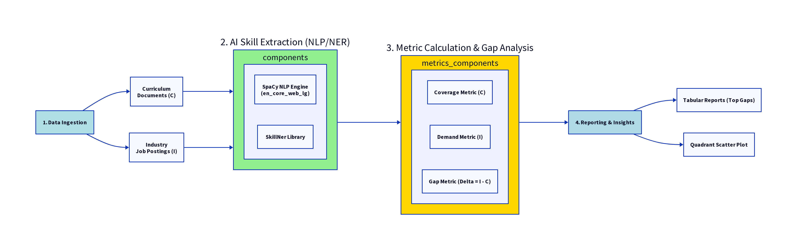

## AI System Architecture: Skill Gap Analysis Pipeline

This system is designed to automatically identify mismatches between the skills taught in a curriculum (Supply) and the skills demanded by the industry (Demand). It relies on a specialized Natural Language Processing (NLP) pipeline to turn unstructured text into quantifiable metrics.

System Components and Flow

The architecture is implemented as a sequential, four-stage pipeline:

1. Data Ingestion (Input)

This stage is responsible for taking raw, unstructured text data and preparing it for the core AI processing.

Curriculum Documents (Supply Data): A collection of course descriptions, syllabi, objectives, and topics.
Metric: Used to calculate Skill Coverage (C).
Industry Job Postings (Demand Data): A collection of job descriptions, responsibilities, and qualifications.
Metric: Used to calculate Skill Demand (I).

2. AI Skill Extraction (NLP/NER Core)

This is the core AI step that converts raw text into structured data (lists of identified skills).

SpaCy NLP Engine (en_core_web_lg): A high-performance library used for tokenization, part-of-speech tagging, and generally preparing the text.

SkillNer Library: A custom Named Entity Recognition (NER) model built on top of SpaCy. It is specifically trained to identify and tag professional skills, certifications, and technologies (e.g., "Python", "Kubernetes", "REST API") within the curriculum and industry texts.

Process: The system iterates over every document in both datasets, and the SkillNer model extracts all recognized skills, creating a structured database of skill occurrences.

3. Metric Calculation & Gap Analysis (Feature Engineering)

Once skills are extracted, this stage quantifies the relationship between curriculum and industry.

Skill Coverage (C): Calculated for each unique skill as the percentage of curriculum documents mentioning that skill. (Represents Supply).
Skill Demand (I): Calculated for each unique skill as the percentage of industry job postings mentioning that skill. (Represents Demand).

Gap Metric ($\Delta$): The final analytical result, calculated as the difference between Demand and Coverage:

$$\Delta = \text{Demand (I)} - \text{Coverage (C)}$$

Positive $\Delta$ (Shortage): Indicates high industry demand but low curriculum coverage (e.g., $\Delta = +0.6$).
Negative $\Delta$ (Overkill): Indicates low industry demand but high curriculum coverage (e.g., $\Delta = -0.3$).
Near Zero $\Delta$ (Aligned): Indicates balanced supply and demand.

4. Reporting & Insights (Output)

The final stage presents the findings to stakeholders in an easily digestible format.

Tabular Reports: Markdown tables listing the top Shortage skills (highest positive $\Delta$), Overkill skills (most negative $\Delta$), and Aligned skills.

Quadrant Scatter Plot: A visual representation where the X-axis is Coverage (C) and the Y-axis is Demand (I). The plot is divided into four strategic quadrants (Shortage, Aligned, Overkill, Low Priority), allowing stakeholders to immediately grasp the position of every skill relative to the mean.
